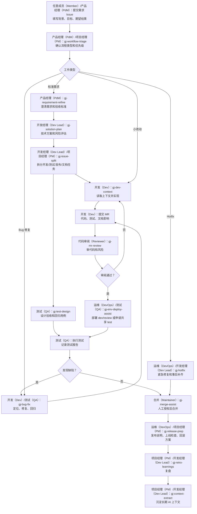

# gj-gitlab-ai-workflow

这是一个面向 GitLab CE 项目的 AI 协作工作流骨架。它提供 GitLab 模板、项目
上下文目录、CI 门禁脚本、角色交接规则，以及一组可以安装到 Codex 的 workflow
skills。

核心目标不是让 AI 自主审批、合并或发布，而是让团队里的产品经理（PdM）、项目经理
（PM）、开发经理（Dev Lead）、开发（Dev）、代码审阅（Reviewer）、测试（QA）、运维
（DevOps）、合并（Maintainer）都可以用 AI 辅助完成自己负责的动作。最终责任和确认权
仍然在人手里。

## 这个项目提供什么

- GitLab Issue / MR 模板和标签建议。
- `.ai/project.yml`、`.ai/rule-map.yml`、`.ai/context-index.yml`、`.ai/role-map.yml`
  等 AI 工作流配置。
- `docs/context`、`docs/modules`、`docs/iterations` 等长期上下文目录。
- PRD、产品设计、原型记录、技术方案、测试计划、测试报告、发布说明等文档模板。
- 目标业务项目可用的 CI 模板：`policy -> workflow -> test -> release`。
- `policy_check.py`、`workflow_assets_check.py`、`validate_role_map.py` 等检查脚本。
- GitLab webhook Orchestrator 骨架。
- 一组从真实 demo 流程提炼出来的 Codex skills。
- `examples/demo-project` 和 `examples/demo-run`，用于查看一次端到端模拟留下的样例产物。

## 角色怎么理解

| 统一称呼 | 主要责任 |
| --- | --- |
| 产品经理（PdM） | 负责需求来源、业务目标、验收标准、非目标、产品规则、原型/交互说明。 |
| 项目经理（PM） | 负责推进节奏、排期、风险、跨角色协调、复盘和待办闭环。 |
| 开发经理（Dev Lead） | 负责技术方案、架构判断、任务拆分、技术风险、技术评审口径。 |
| 开发（Dev） | 负责编码、单测、自测、提交 MR、修复审阅或测试发现的问题。 |
| 代码审阅（Reviewer） | 负责审 MR，检查代码质量、风险路径、测试覆盖和文档影响。 |
| 合并（Maintainer） | 负责最终合并判断和合并操作，通常需要 GitLab 维护者权限。 |
| 测试（QA） | 负责测试计划、验收测试、回归测试、测试报告、缺陷跟踪。 |
| 运维（DevOps） | 负责 CI/CD、环境部署、共享测试环境锁、发布准备、回滚方案。 |
| 任意成员（Member） | 通过 `gj-workflow-inbox` 查看分配给自己的 GitLab 待办。 |

## 新项目怎么初始化

这里的“新项目”指你自己的业务项目，不是把业务项目打包成这个开源项目。

1. 先在本仓库安装 Codex skills：

```powershell
python scripts/install_skills.py --force
```

2. 在目标业务项目里安装工作流资产。全新项目可以直接安装：

```powershell
python scripts/install_workflow.py --target C:\path\to\your-project
```

已有项目建议先只补缺失文件：

```powershell
python scripts/install_workflow.py --target C:\path\to\your-project --only-missing
```

确实要覆盖模板时再使用备份模式：

```powershell
python scripts/install_workflow.py --target C:\path\to\your-project --force --backup
```

3. 使用 `gj-workflow-bootstrap` 辅助初始化目标项目：

- 确认 GitLab labels、Issue/MR 模板、CI、目录结构是否完整。
- 填写 `.ai/project.yml` 的项目基本信息。
- 填写 `.ai/role-map.yml`，把产品经理（PdM）、项目经理（PM）、开发经理（Dev Lead）、
  开发（Dev）、代码审阅（Reviewer）、合并（Maintainer）、测试（QA）、运维（DevOps）
  映射到真实 GitLab 用户。
- 确认 `.ai/rule-map.yml` 的 MR 门禁规则。
- 确认 `CODEOWNERS`、保护分支、必须通过 pipeline 后才能 merge。

4. 如果是已有代码项目，继续使用 `gj-codebase-map`：

- 扫描现有模块、入口、关键流程、测试和风险点。
- 生成或更新 `docs/context/current-state.md`。
- 生成或更新 `docs/context/module-map.md`。
- 生成或更新 `docs/modules/*.md`。
- 更新 `.ai/context-index.yml`，让后续 AI 能稳定读取项目背景。

5. 配置 GitLab 通知和待办来源：

- GitLab Issue 的 `assignee` 是当前处理人。
- GitLab MR 的 `reviewer` 是当前代码审阅。
- 交接评论必须 `@username`。
- 企业微信、邮箱等只是 GitLab 通知投递渠道。
- 个人待办统一由 `gj-workflow-inbox` 通过 GitLab API 读取，不绕到邮件里解析。

## 一个新需求怎么流转

新需求的入口是创建 GitLab Issue。`gj-workflow-inbox` 不是需求提交入口，它只是在
后续节点被指派给某个人以后，用来读取个人待办。



| 阶段 | 角色 | 使用 skill | 产物 |
| --- | --- | --- | --- |
| 需求提交 | 任意成员（Member）/ 产品经理（PdM） | GitLab Issue 模板；需要 AI 起草时可用 `gj-requirement-refine` | 需求 Issue，包含背景、目标、期望结果、初步优先级、相关截图/链接 |
| 需求分流 | 产品经理（PdM）/ 项目经理（PM） | `gj-workflow-triage` | 判断走标准需求、小改动、Bug 修复还是 Hotfix |
| 需求澄清 | 产品经理（PdM） | `gj-requirement-refine` | 需求 Issue、验收标准、非目标、风险、文档影响 |
| 方案设计 | 开发经理（Dev Lead） | `gj-solution-plan` | 技术方案、影响范围、测试策略、发布和回滚思路 |
| 任务拆分 | 开发经理（Dev Lead）/ 项目经理（PM） | `gj-issue-split` | 开发、测试、发布、文档、后续事项等可追踪 Issue |
| 开发准备 | 开发（Dev） | `gj-dev-context` | 当前 Issue 相关上下文、应读文件、风险点、实现边界 |
| 提交 MR | 开发（Dev） | 常规开发 + MR 模板 | 代码、测试、文档影响说明、关联 Issue |
| MR 审阅 | 代码审阅（Reviewer） | `gj-mr-review` | 审阅意见、阻塞项、风险路径、是否建议合并 |
| 环境部署 | 运维（DevOps）/ 测试（QA） | `gj-env-deploy-assist` | dev/test 部署计划、环境锁、版本记录、回滚目标 |
| 测试设计与执行 | 测试（QA） | `gj-test-design` | 测试计划、验收用例、回归用例、失败路径、测试报告 |
| 缺陷处理 | 开发（Dev）/ 测试（QA） | `gj-bug-fix` | Bug 根因、修复范围、回归验证、修复 MR |
| 合并辅助 | 代码审阅（Reviewer）/ 合并（Maintainer） | `gj-merge-assist` | 合并前检查、pipeline 状态、讨论状态、人工授权后的 merge 操作 |
| 发布准备 | 运维（DevOps）/ 项目经理（PM） | `gj-release-prep` | 发布说明、上线检查、回滚方案、发布确认 |
| 复盘沉淀 | 项目经理（PM）/ 开发经理（Dev Lead） | `gj-retro-learnings` | 复盘结论、流程改进、遗留问题 |
| 上下文更新 | 项目经理（PM）/ 开发经理（Dev Lead） | `gj-context-extract` | `ai-context-summary.md`、模块文档、ADR、context index 更新 |
| 下一步判断 | 任意成员（Member） | `gj-workflow-next` | 根据当前 GitLab 状态推荐下一步动作和 skill |

每个节点完成后，都要在 GitLab 上设置下一个处理人的 assignee/reviewer，并用
`@username` 评论交接。被指派的人可以用 `gj-workflow-inbox` 查看自己的待办，再进入
对应节点的 skill。

关键规则：

- 没有 Issue 不开发。
- 没有验收标准不排期。
- 复杂需求没有方案评审不进入开发。
- 代码必须通过 MR 合并。
- Pipeline 必须成功才能合并。
- AI 可以辅助审批判断、审阅、合并检查、发布准备，但不能脱离人的明确授权自主审批、自主合并、自主发布。
- 每个需要人处理的节点都要设置 assignee/reviewer，并用 `@username` 评论交接。
- Issue/MR 记录讨论过程，仓库 `docs/` 记录稳定结论。

## 常用 skill 使用场景

| Skill | 什么时候用 |
| --- | --- |
| `gj-workflow-bootstrap` | 新项目接入工作流、初始化模板/目录/CI/角色映射/门禁规则 |
| `gj-codebase-map` | 旧项目第一次接入，或项目结构变化很大，需要重新整理 AI 上下文 |
| `gj-workflow-inbox` | 每天开始工作、切换上下文、检查分配给自己的 GitLab 待办 |
| `gj-workflow-triage` | 新 Issue 进入时，判断是标准需求、小改动、Bug 还是 Hotfix |
| `gj-requirement-refine` | 需求还不清楚、验收标准不足、需要补 PRD 或产品设计 |
| `gj-solution-plan` | 需求涉及接口、数据、权限、流程、环境、回滚或跨模块影响 |
| `gj-issue-split` | 方案明确后，把一个大需求拆成开发、测试、发布、文档等子任务 |
| `gj-dev-context` | 开发动手前，让 AI 读取当前 Issue/MR 相关上下文和代码范围 |
| `gj-mr-review` | 代码审阅（Reviewer）审 MR 时，用 AI 辅助看风险、测试、文档影响和遗漏 |
| `gj-merge-assist` | 合并（Maintainer）已决定可以合并，需要 AI 做合并前检查或执行被授权的 merge |
| `gj-test-design` | 测试（QA）设计验收、回归、权限、失败路径、发布验证用例 |
| `gj-env-deploy-assist` | 需要部署 dev/review/test 环境，尤其是共享测试环境需要环境锁和人工确认 |
| `gj-bug-fix` | 测试（QA）或线上发现缺陷，需要复现、定位根因、修复和回归 |
| `gj-hotfix` | P0/P1、生产阻塞、安全风险等紧急问题 |
| `gj-release-prep` | 准备发布说明、上线检查、回滚方案、发布确认 |
| `gj-retro-learnings` | 迭代结束后复盘流程问题、失败点、人工确认点和改进项 |
| `gj-context-extract` | 把一次需求/修复/发布的稳定结论沉淀到长期 AI 上下文 |
| `gj-workflow-next` | 不确定当前该做什么时，让 AI 根据 GitLab 状态推荐下一步 |

## 文档怎么维护

每个核心 skill 都应该输出 `Documentation impact`，说明本次是否需要创建或更新正式文档。

默认规则：

- GitLab Issue/MR：记录讨论、澄清、人工确认、交接和审阅过程。
- 仓库 `docs/`：记录长期有效的产品、技术、测试、发布和 AI 上下文结论。

常见文档位置：

| 内容 | 推荐路径 |
| --- | --- |
| 产品需求、验收标准、业务规则 | `docs/product/requirements/<feature>.md` |
| 页面、交互、用户流、错误文案 | `docs/product/designs/<feature>.md` |
| 原型链接、截图、HTML demo、可点击原型记录 | `docs/product/prototypes/<feature>.md` |
| 架构、接口、数据、权限、兼容、发布和回滚 | `docs/technical/solutions/<feature>.md` |
| 验收、回归、权限、失败路径、发布验证 | `docs/qa/test-plans/<feature>.md` |
| 测试执行结果、失败项、阻塞项 | `docs/qa/test-reports/<feature>.md` |
| 用户可见变更、部署步骤、回滚步骤 | `docs/releases/<version>.md` |
| 长期 AI 上下文 | `docs/context`、`docs/modules`、`docs/iterations/*/ai-context-summary.md`、`.ai/context-index.yml` |

## 目标项目 CI/CD

安装到业务项目里的 GitLab CI 是业务项目流水线：

```text
policy -> workflow -> test -> release
```

它不包含 `skill_validate` 或 `package_open_source`。这些是维护本开源工作流项目时才需要的检查，不应该出现在每个业务项目的流水线里。

各阶段含义：

- `policy`：检查 MR 描述、文档影响、规则责任人确认、疑似 secret 等。
- `workflow`：检查工作流资产是否完整，`.ai/role-map.yml` 是否已经映射到真实人员。
- `test`：运行目标项目自己的测试或 smoke check。
- `release`：生成 release dry run，用于发布前人工确认。

环境建议：

- `dev/review` 环境可以跟随分支或 MR 自动部署，最好是隔离环境。
- 共享 `test/staging` 环境不建议被每个 MR 自动覆盖，需要人工确认、环境锁、版本记录和回滚目标。
- 生产发布必须走发布治理，不能由 AI 或普通分支 pipeline 自动发布。

## 本仓库维护命令

这些命令用于维护 `gj-gitlab-ai-workflow` 这个开源项目本身：

```powershell
python scripts/policy_check.py --mr-description examples/demo-run/mr/merge-request.md --changed-files examples/demo-run/mr/changed-files.txt
python scripts/validate_role_map.py --role-map templates/ai/role-map.yml --allow-placeholders
python scripts/validate_skills.py
python scripts/install_skills.py --dry-run
python scripts/install_workflow.py --target C:\path\to\your-project --dry-run --only-missing
python scripts/package_open_source.py --output dist\gj-gitlab-ai-workflow.zip
python scripts/release_dry_run.py --package dist\gj-gitlab-ai-workflow.zip --output build\release-dry-run.md
```

## 安全边界

- 不要提交本地 API helper、token、私有 GitLab 配置或生产数据。
- 不要把密码、密钥、客户隐私、生产日志直接放进 prompt 或仓库。
- AI 输出必须落到 GitLab 评论或仓库文档，方便追溯。
- AI 可以辅助人做决定，但不能替代责任人做决定。

更多细节见：

- `docs/quickstart.md`
- `docs/workflow.md`
- `docs/skills.md`
- `docs/cicd.md`
