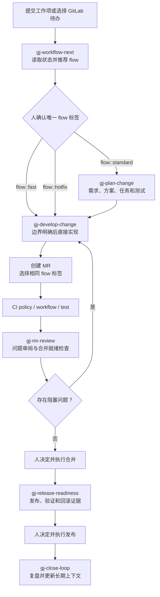
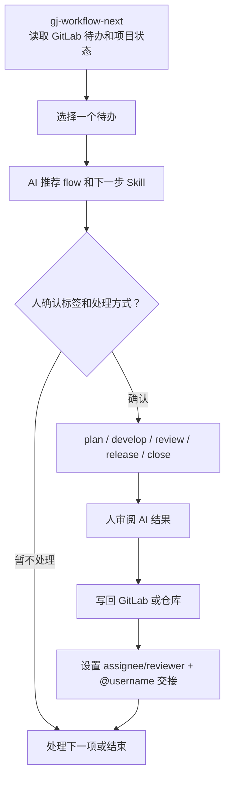

# gj-gitlab-ai-workflow

这是一个面向 GitLab CE 项目的 AI 协作工作流骨架。它提供 GitLab 模板、项目
上下文目录、CI 门禁脚本、角色交接规则，以及一组遵循 Agent Skills 开放格式、
可同时用于 Codex、Claude Code 和 OpenCode 的 workflow skills。

核心目标不是让 AI 自主审批、合并或发布，而是让团队里的产品经理（PdM）、项目经理
（PM）、开发经理（Dev Lead）、开发（Dev）、代码审阅（Reviewer）、测试（QA）、运维
（DevOps）、合并（Maintainer）都可以用 AI 辅助完成自己负责的动作。最终责任和确认权
仍然在人手里。

## 这个项目提供什么

- GitLab Issue / MR 模板，以及 `flow::fast`、`flow::standard`、
  `flow::hotfix` 三个流程标签。
- `.ai/project.yml`、`.ai/rule-map.yml`、`.ai/context-index.yml`、`.ai/role-map.yml`
  等 AI 工作流配置。
- `docs/context`、`docs/modules`、`docs/iterations` 等长期上下文目录。
- PRD、产品设计、原型记录、技术方案、测试计划、测试报告、发布说明等文档模板。
- 目标业务项目 CI：MR 运行 `policy -> workflow -> test`，tag 或手工发布再运行 `release`。
- `policy_check.py`、`workflow_assets_check.py`、`validate_role_map.py` 等检查脚本。
- GitLab webhook Orchestrator 骨架。
- 八个从真实 demo 流程提炼出来的跨 Agent workflow skills。
- 所有 Skill 固定使用 `gj-` 前缀；GJ 是“公交”工作流的简称。
- `examples/demo-project` 和 `examples/demo-run`，用于查看一次端到端模拟留下的样例产物。

## 角色怎么理解

| 统一称呼 | 主要责任 |
| --- | --- |
| 产品经理（PdM） | 负责需求来源、业务目标、验收标准、非目标、产品规则、原型/交互说明。 |
| 项目经理（PM） | 负责推进节奏、排期、风险、跨角色协调、复盘和待办闭环。 |
| 开发经理（Dev Lead） | 负责技术方案、架构判断、任务拆分、技术风险、技术评审口径。 |
| 开发（Dev） | 负责编码、单测、自测、提交 MR、修复审阅或测试发现的问题。 |
| 代码审阅（Reviewer） | 负责审 MR，检查代码质量、风险路径、测试覆盖和文档影响。 |
| 合并（Maintainer） | 负责最终合并判断和合并操作，通常需要 GitLab 维护者权限。 |
| 测试（QA） | 负责测试计划、验收测试、回归测试、测试报告、缺陷跟踪。 |
| 运维（DevOps） | 负责 CI/CD、环境部署、共享测试环境锁、发布准备、回滚方案。 |
| 任意成员（Member） | 通过 `gj-workflow-next` 查看待办、确认 flow 和下一步。 |

这些是责任帽子，不代表必须有对应人数；同一个人可以承担多个角色。高风险改动仍建议由第二个人确认。

## 新项目怎么初始化

这里的“新项目”指你自己的业务项目，不是把业务项目打包成这个开源项目。

1. 在目标业务项目根目录，用同一个 GitHub 地址安装全部 workflow skills：

```powershell
npx --yes skills@1.5.15 add https://github.com/TheLastMagician/gj-gitlab-ai-workflow --skill '*' -a codex -a claude-code -a opencode --copy -y
```

这条命令从仓库的 `skills/*/SKILL.md` 读取唯一源码，并安装到：

| Agent | 项目内发现目录 |
| --- | --- |
| Codex | `.agents/skills` |
| Claude Code | `.claude/skills` |
| OpenCode | `.agents/skills` |

`--copy` 避免 Windows 的符号链接权限问题。安装完成后新开一个 Agent 会话即可发现
skills。GitHub 链接本身不会、也不应该绕过本机安全策略自动执行；用户需要显式运行
上面的命令，或者明确让当前 Agent 执行安装。

没有 Node.js 时，可以 clone 本仓库后使用 Python 兜底安装器：

```powershell
python scripts/install_skills.py --agent all --project-root C:\path\to\your-project --force
```

不要维护三套 `SKILL.md`。`AGENTS.md`、`CLAUDE.md` 是项目入口说明，不是 Skill
安装包；只有未来需要 hooks、MCP 或 Agent 专属启动逻辑时，才增加对应插件清单。

2. 在目标业务项目里一次性安装工作流资产：

```powershell
python scripts/install_workflow.py --target C:\path\to\your-project
```

安装只做一次。日常流程由工作项和 MR 的 `flow::*` 标签决定，
不需要重新安装或升级工作流。

已有项目建议先只补缺失文件：

```powershell
python scripts/install_workflow.py --target C:\path\to\your-project --only-missing
```

确实要覆盖模板时再使用备份模式：

```powershell
python scripts/install_workflow.py --target C:\path\to\your-project --force --backup
```

3. 使用 `gj-workflow-bootstrap` 辅助初始化目标项目：

- 确认 GitLab labels、Issue/MR 模板、CI、目录结构是否完整。
- 创建 `flow::fast`、`flow::standard`、`flow::hotfix` 标签。
- 填写 `.ai/project.yml` 的项目基本信息。
- 按需填写 `.ai/role-map.yml`，把产品经理（PdM）、项目经理（PM）、开发经理（Dev Lead）、
  开发（Dev）、代码审阅（Reviewer）、合并（Maintainer）、测试（QA）、运维（DevOps）
  映射到真实 GitLab 用户。
- 确认 `.ai/rule-map.yml` 的 MR 门禁规则。
- 确认保护分支、可合并角色、必须通过 Pipeline 后才能 merge。
- `CODEOWNERS` 仅用于推荐 Reviewer，不作为 GitLab CE 强制审批证据。

4. 如果是已有代码项目，继续使用 `gj-codebase-map`：

- 扫描现有模块、入口、关键流程、测试和风险点。
- 生成或更新 `docs/context/current-state.md`。
- 生成或更新 `docs/context/module-map.md`。
- 生成或更新 `docs/modules/*.md`。
- 更新 `.ai/context-index.yml`，让后续 AI 能稳定读取项目背景。

5. 配置 GitLab 通知和待办来源：

- GitLab Issue 的 `assignee` 是当前处理人。
- GitLab MR 的 `reviewer` 是当前代码审阅。
- 交接评论必须 `@username`。
- 企业微信、邮箱等只是 GitLab 通知投递渠道。
- 个人待办统一由 `gj-workflow-next` 通过 GitLab API 读取，不绕到邮件里解析。

## 一个新需求怎么流转

新需求的入口是 GitLab Issue。日常只需要从 `gj-workflow-next` 开始，它读取待办、
推荐 flow 和下一步；人确认唯一 flow 标签后，AI 才按对应深度继续。

最短操作路径：

```text
创建工作项
  -> gj-workflow-next 推荐 flow
  -> 人在编码前确认唯一 flow 标签
  -> plan-change（Fast 可极简）
  -> develop-change 开发和自测
  -> 创建 MR，并选择同一个 flow 标签
  -> CI + mr-review
  -> 人决定合并和发布
  -> close-loop 更新长期上下文
```



| 阶段 | 角色 | 使用 skill | 产物 |
| --- | --- | --- | --- |
| 入口和分流 | 任意成员（Member） | `gj-workflow-next` | 待办、flow 建议、阻塞项和下一步；人确认标签 |
| 变更计划 | 产品经理（PdM）/开发经理（Dev Lead） | `gj-plan-change` | 与 flow 匹配的验收、方案、任务、测试和回滚计划 |
| 开发和修复 | 开发（Dev） | `gj-develop-change` | 功能、Fast 改动、Bug 或 Hotfix 的实现、测试和文档 |
| MR 审阅 | 代码审阅（Reviewer） | `gj-mr-review` | 按严重级别排列的问题和合并就绪结论 |
| 合并 | 合并（Maintainer） | GitLab | 人检查证据并决定、执行合并 |
| 发布准备 | 运维（DevOps）/测试（QA） | `gj-release-readiness` | 环境锁、发布说明、验证、回滚和人工确认项 |
| 发布 | 运维（DevOps）/Maintainer | GitLab CI/CD | 人决定、执行发布 |
| 收尾 | 项目经理（PM）/开发经理（Dev Lead） | `gj-close-loop` | 复盘、模块文档、ADR、context index 和摘要更新 |

每个节点完成后，都要在 GitLab 上设置下一个处理人的 assignee/reviewer，并用
`@username` 评论交接。被指派的人可以用 `gj-workflow-next` 查看自己的待办，再进入
对应节点的 skill。

关键规则：

- Standard / Hotfix 必须关联 Issue；Fast 低风险 MR 可以不建 Issue。
- 工作开始前由人确认唯一通道标签：`flow::fast`、`flow::standard` 或 `flow::hotfix`。
- 创建 MR 时选择同一个 flow 标签；CI 校验缺失、冲突和高风险误用。
- 没有验收标准不排期。
- 复杂需求没有方案评审不进入开发。
- 代码必须通过 MR 合并。
- Pipeline 必须成功才能合并。
- 低风险 Fast MR 不要求额外审批人数；高风险 changed files 不能走 Fast。
- GitLab CE 的硬门禁是成功 Pipeline、保护分支和受限合并权限，
  不使用 `/owner-ack` 字符串伪装审批。
- AI 可以辅助审批判断、审阅、合并检查、发布准备，但不能脱离人的明确授权自主审批、自主合并、自主发布。
- 每个需要人处理的节点都要设置 assignee/reviewer，并用 `@username` 评论交接。
- Issue/MR 记录讨论过程，仓库 `docs/` 记录稳定结论。

## 个人如何用 AI 处理待办

对个人来说，日常入口只有 `gj-workflow-next`。它读取 GitLab Todo、Issue、MR、
审阅请求、失败 Pipeline 和未解决讨论，推荐 flow 和下一步 Skill；人确认后再执行。



| 待办类型 | 常用 skill | 人需要确认什么 |
| --- | --- | --- |
| 新工作、Bug 或流程阻塞 | `gj-workflow-next` | flow 标签、优先级和下一步。 |
| 需求、方案、任务和测试设计 | `gj-plan-change` | 验收、方案、风险、任务边界和测试覆盖。 |
| 开发、Bug 修复或 Hotfix | `gj-develop-change` | 实现范围、测试、文档和回滚。 |
| MR 审阅或合并前检查 | `gj-mr-review` | 阻塞问题和是否进入人的合并决定。 |
| 环境或发布准备 | `gj-release-readiness` | 环境锁、部署版本、验证、回滚和发布窗口。 |
| 复盘或上下文沉淀 | `gj-close-loop` | 长期事实、文档更新和后续事项。 |

这不是“AI 自动把所有事情做完”。正确边界是：AI 帮人读取上下文、生成草稿、做检查、
执行范围明确的分析、代码、文档和测试；人负责 flow、审批、合并、发布和交接。

## 常用 skill 使用场景

| Skill | 什么时候用 |
| --- | --- |
| `gj-workflow-bootstrap` | 新项目接入，安装并检查标签、模板、上下文和 CI 门禁 |
| `gj-codebase-map` | 旧项目第一次接入或大型重构后刷新代码库上下文 |
| `gj-workflow-next` | 每天开始工作、检查待办、推荐 flow 或判断下一步 |
| `gj-plan-change` | 需求、方案、任务、测试或回滚需要按 flow 规划 |
| `gj-develop-change` | 实现功能、Fast 改动、Bug 修复或 Hotfix |
| `gj-mr-review` | 审 MR、检查风险和测试，并给出合并就绪结论 |
| `gj-release-readiness` | 准备环境、发布说明、验证、监控和回滚证据 |
| `gj-close-loop` | 完成后复盘并更新长期文档和 AI 上下文 |

## 文档怎么维护

每个核心 skill 都应该输出 `Documentation impact`，说明本次是否需要创建或更新正式文档。

默认规则：

- GitLab Issue/MR：记录讨论、澄清、人工确认、交接和审阅过程。
- 仓库 `docs/`：记录长期有效的产品、技术、测试、发布和 AI 上下文结论。

常见文档位置：

| 内容 | 推荐路径 |
| --- | --- |
| 产品需求、验收标准、业务规则 | `docs/product/requirements/<feature>.md` |
| 页面、交互、用户流、错误文案 | `docs/product/designs/<feature>.md` |
| 原型链接、截图、HTML demo、可点击原型记录 | `docs/product/prototypes/<feature>.md` |
| 架构、接口、数据、权限、兼容、发布和回滚 | `docs/technical/solutions/<feature>.md` |
| 验收、回归、权限、失败路径、发布验证 | `docs/qa/test-plans/<feature>.md` |
| 测试执行结果、失败项、阻塞项 | `docs/qa/test-reports/<feature>.md` |
| 用户可见变更、部署步骤、回滚步骤 | `docs/releases/<version>.md` |
| 长期 AI 上下文 | `docs/context`、`docs/modules`、`docs/iterations/*/ai-context-summary.md`、`.ai/context-index.yml` |

## 目标项目 CI/CD

安装到业务项目里的 GitLab CI 是业务项目流水线：

```text
Fast / Standard MR: policy -> workflow -> test
Tag / 手工主分支发布: policy -> workflow -> test -> release
```

它不包含 `skill_validate` 或 `package_open_source`。这些是维护本开源工作流项目时才需要的检查，不应该出现在每个业务项目的流水线里。

各阶段含义：

- `policy`：要求唯一 `flow::*` 标签，并检查 MR 内容、文档影响、changed-file 风险和疑似 secret。
- `workflow`：检查工作流资产；角色映射校验按需开启。
- `test`：运行目标项目自己的测试或 smoke check。
- `release`：生成 release dry run，用于发布前人工确认。

Fast MR 默认只跑 policy、workflow assets 和 test。上下文新鲜度只在相关
文档变化时运行；release dry run 只在 tag 或手工主分支流水线运行。

环境建议：

- `dev/review` 环境可以跟随分支或 MR 自动部署，最好是隔离环境。
- 共享 `test/staging` 环境不建议被每个 MR 自动覆盖，需要人工确认、环境锁、版本记录和回滚目标。
- 生产发布必须走发布治理，不能由 AI 或普通分支 pipeline 自动发布。

## 本仓库维护命令

这些命令用于维护 `gj-gitlab-ai-workflow` 这个开源项目本身：

```powershell
python scripts/policy_check.py --mr-description examples/demo-run/mr/merge-request.md --changed-files examples/demo-run/mr/changed-files.txt --labels flow::standard
python scripts/validate_role_map.py --role-map templates/ai/role-map.yml --allow-placeholders
python scripts/validate_skills.py
python scripts/install_skills.py --dry-run
python scripts/install_workflow.py --target C:\path\to\your-project --dry-run --only-missing
python scripts/package_open_source.py --output dist\gj-gitlab-ai-workflow.zip
python scripts/release_dry_run.py --package dist\gj-gitlab-ai-workflow.zip --output build\release-dry-run.md
```

## 安全边界

- 不要提交本地 API helper、token、私有 GitLab 配置或生产数据。
- 不要把密码、密钥、客户隐私、生产日志直接放进 prompt 或仓库。
- AI 输出必须落到 GitLab 评论或仓库文档，方便追溯。
- AI 可以辅助人做决定，但不能替代责任人做决定。

更多细节见：

- `docs/quickstart.md`
- `docs/workflow.md`
- `docs/skills.md`
- `docs/cicd.md`
