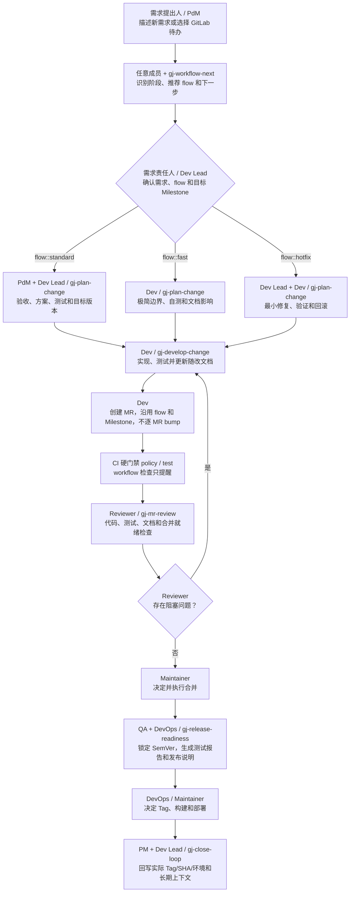
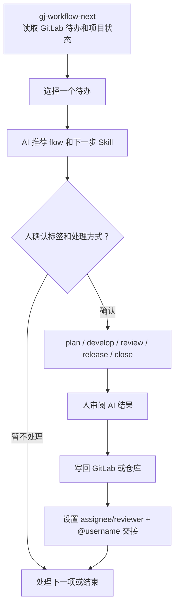

# gj-gitlab-ai-workflow

这是一个面向 GitLab CE 项目的 AI 协作工作流骨架。它提供 GitLab 模板、项目
上下文目录、轻量 CI 检查、角色交接规则，以及一组遵循 Agent Skills 开放格式、
可同时用于 Codex、Claude Code 和 OpenCode 的 workflow skills。

核心目标不是让 AI 自主审批、合并或发布，而是让团队里的产品经理（PdM）、项目经理
（PM）、开发经理（Dev Lead）、开发（Dev）、代码审阅（Reviewer）、测试（QA）、运维
（DevOps）、合并（Maintainer）都可以用 AI 辅助完成自己负责的动作。最终责任和确认权
仍然在人手里。

## 快速安装 Skills

在需要使用工作流的业务项目根目录运行一条命令，即可同时安装到 Codex、
Claude Code 和 OpenCode：

```powershell
npx --yes skills@1.5.17 add https://github.com/TheLastMagician/gj-gitlab-ai-workflow --skill '*' -a codex -a claude-code -a opencode --copy -y
```

安装结果：Codex 和 OpenCode 使用项目内 `.agents/skills`，Claude Code 使用
`.claude/skills`。安装后重新打开 Agent 会话。只使用一个 Agent 时，可以只保留对应的
`-a codex`、`-a claude-code` 或 `-a opencode` 参数。

GitHub 链接不会自动执行代码；用户需要运行上述命令，或明确要求当前 Agent 执行安装。
没有 Node.js 时，先 clone 本仓库，再运行 Python 兜底安装器：

```powershell
python scripts/install_skills.py --agent all --project-root C:\path\to\your-project --force
```

这一步安装 8 个 `gj-*` Skills。随后在当前 Agent 中执行
`gj-workflow-bootstrap` 初始化本项目。bootstrap Skill 自带 GitHub 引导器，即使业务
项目里还没有 `scripts/install_workflow.py`，也能获取同源模板并完成非破坏式安装。

## GitLab 访问令牌怎么配置

只安装 Skill、生成计划或处理本地代码不需要 Token。以下操作需要连接真实 GitLab：

- `gj-workflow-next` 读取个人 Todo、Issue、MR、讨论和 Pipeline；
- 校验项目成员与角色映射；
- 经人确认后创建 Issue、设置标签或处理人、发布交接评论。

安装工作流资产后，在业务项目中配置一次内置 helper：

```powershell
python scripts/gitlab_api.py configure --url https://gitlab.example.com --project-id group/project
python scripts/gitlab_api.py doctor
```

`configure` 会隐藏输入 Token，并保存到项目内 `.gj/gitlab.local.json`。安装器自动将
该文件加入 `.gitignore`，因此 Codex、Claude Code 和 OpenCode 在这个项目中都能复用
同一配置，不必为每个终端重复设置环境变量。配置文件含明文 Token，只能保存在本机，
不得提交或发送给 AI。

读取自己的 Todo 时使用当前用户的 Personal Access Token：只读场景选择 `read_api`；
确实需要写 Issue、标签、处理人或评论时才选择 `api`。自动化服务可改用独立的 Project
Access Token，但它代表机器人账号，不能代替当前用户的个人 Todo。Token 应设置较短
有效期并只给最低项目角色；不要选择 `sudo`、`write_repository` 或管理员权限。

内置 helper 默认只读；写操作需要人确认、`--confirm-write`，并自动核对 GitLab 项目
与 `git remote origin`。已有 GitLab MCP/连接器可以作为可选替代。CI 中仍使用
`GITLAB_URL`、`GITLAB_PROJECT_ID`、`GITLAB_TOKEN` masked/protected 变量覆盖本地
配置。完整命令和安全边界见 [GitLab 访问配置](docs/gitlab-access.md)。

## 这个项目提供什么

- GitLab Issue / MR 模板，以及 `flow::fast`、`flow::standard`、
  `flow::hotfix` 三个流程标签。
- `.gj/workflow.yml` 集中保存项目、角色交接和风险规则；`.gj/context.yml`
  保存 AI 上下文白名单；本机凭据单独放在被忽略的 `.gj/gitlab.local.json`。
- `docs/context`、`docs/product`、`docs/technical`、`docs/modules`、`docs/qa`、
  `docs/releases` 和 `docs/standards` 等长期文档目录。
- 安装在 `.gj/doc-templates/` 的 PRD、产品设计、技术方案、API、数据库、ADR、
  模块、测试和发布文档模板；项目事实目录不预置空白模板。
- 目标业务项目 CI：MR 只由 `policy -> test` 硬阻断，工作流资产检查只提醒；
  版本检查仅在 Tag 流水线运行，发布清单仅在 Tag 或手工默认分支流水线运行。
- `policy_check.py`、`workflow_assets_check.py`、`validate_role_map.py` 等检查脚本。
- SemVer/Milestone/Tag/构建/部署版本治理，以及仅在 Tag Pipeline 运行的
  `release_version_check.py`。
- GitLab webhook Orchestrator 骨架。
- 八个跨 Agent workflow skills。
- 所有 Skill 固定使用 `gj-` 前缀；GJ 是“公交”工作流的简称。
- `examples/demo-project` 和 `examples/demo-run`，用于查看一次端到端模拟留下的样例产物。

`.gj/` 是 GJ 工作流的跨 Agent 机器配置目录，不属于某个 AI 工具。Codex、Claude Code、
OpenCode 和本地脚本读取同一份配置；面向人的长期事实仍放在 `docs/`。

## Fast、Standard、Hotfix 怎么选

| 标签 | 适用场景 | Issue | 计划和证据 | 合并与发布要求 |
| --- | --- | --- | --- | --- |
| `flow::fast` | typo、文案、低风险小修复、范围明确且验证简单的局部改动 | 可选；需要排期、协作或追踪时再建 SmallChange Issue | 极简计划；MR 写清动机、范围、自测、风险和文档影响 | 正常 MR 和 Pipeline；默认不增加审批人数 |
| `flow::standard` | 新功能、业务规则、权限、金额、API、数据库、跨模块改造，或风险与验证方式不清楚 | 必须关联 Issue | 完整验收标准、技术方案、任务、测试、文档影响、发布和回滚计划 | 人确认方案；policy 与项目测试通过后由有权限的人决定合并 |
| `flow::hotfix` | 生产阻塞、P0/P1、安全事件、数据风险，需要立即止血或修复 | 必须关联 Hotfix Issue | 影响范围、止血方案、最小安全修复、验证和明确回滚；事后补测试、文档和复盘 | 最小必要 Review；人决定紧急发布并验证，随后完成闭环 |

`gj-workflow-next` 根据需求和预计改动路径推荐一个标签，人必须在编码前确认。
有 Issue 时把标签加在 Issue 上，创建 MR 时继续使用同一个且唯一的 `flow::*` 标签。
命中 `.gj/workflow.yml` 高风险路径时不能使用 Fast；CI 会拒绝缺失标签、多个 flow
标签以及高风险改动误用 Fast。

## 角色怎么理解

| 统一称呼 | 主要责任 |
| --- | --- |
| 产品经理（PdM） | 负责需求来源、业务目标、验收标准、非目标、产品规则、原型/交互说明。 |
| 项目经理（PM） | 负责推进节奏、排期、风险、跨角色协调、复盘和待办闭环。 |
| 开发经理（Dev Lead） | 负责技术方案、架构判断、任务拆分、技术风险、技术评审口径。 |
| 开发（Dev） | 负责编码、单测、自测、提交 MR、修复审阅或测试发现的问题。 |
| 代码审阅（Reviewer） | 负责审 MR，检查代码质量、风险路径、测试覆盖和文档影响。 |
| 合并（Maintainer） | 负责最终合并判断和合并操作，通常需要 GitLab 维护者权限。 |
| 测试（QA） | 负责测试计划、验收测试、回归测试、测试报告、缺陷跟踪。 |
| 运维（DevOps） | 负责 CI/CD、环境部署、共享测试环境锁、发布准备、回滚方案。 |
| 任意成员（Member） | 通过 `gj-workflow-next` 查看待办、确认 flow 和下一步。 |

这些是责任帽子，不代表必须有对应人数；同一个人可以承担多个角色。高风险改动仍建议由第二个人确认。

## 新项目怎么初始化

这里的“新项目”指你自己的业务项目，不是把业务项目打包成这个开源项目。

1. 按“快速安装 Skills”执行一次跨 Agent 安装。

2. 在目标业务项目中让当前 Agent 执行：

```text
使用 gj-workflow-bootstrap 初始化当前项目
```

Skill 会调用自身的 `scripts/bootstrap_from_github.py`，获取 GitLab 模板、GJ 配置、
检查脚本和文档骨架。安装器逐文件补齐资产，不删除业务项目已有目录或文件。

从本仓库源码执行时，也可以直接运行：

```powershell
python scripts/install_workflow.py --target C:\path\to\your-project
```

若目标项目已有复杂的 `.gitlab-ci.yml` `include`，安装器不会猜测性改写，而会退出并
给出需要人工加入的 `.gitlab/gj-workflow-ci.yml` include。`--force` 只替换发生冲突的
已知单文件并自动备份，永远不会删除整个 `scripts/` 或 `docs/` 目录。

3. 同一次 `gj-workflow-bootstrap` 继续完成项目初始化：

- 确认 GitLab labels、Issue/MR 模板、CI、目录结构是否完整。
- 创建 `flow::fast`、`flow::standard`、`flow::hotfix` 标签。
- 填写 `.gj/workflow.yml` 的项目基本信息和风险规则。
- 按需填写同一文件的 `roles`，把产品经理（PdM）、项目经理（PM）、开发经理（Dev Lead）、
  开发（Dev）、代码审阅（Reviewer）、合并（Maintainer）、测试（QA）、运维（DevOps）
  映射到真实 GitLab 用户。
- 确认 `.gj/workflow.yml` 的 `rules`。该文件包含风险规则，修改时不能走 Fast。
- 确认保护分支、可合并角色、必须通过 Pipeline 后才能 merge。
- `CODEOWNERS` 仅用于推荐 Reviewer，不作为 GitLab CE 强制审批证据。

4. 如果是已有代码项目，继续使用 `gj-codebase-map`：

- 扫描现有模块、入口、关键流程、测试和风险点。
- 生成或更新 `docs/context/current-state.md`。
- 生成或更新 `docs/context/module-map.md`。
- 生成或更新 `docs/modules/*.md`。
- 更新 `.gj/context.yml`，让后续 AI 能稳定读取项目背景。

5. 配置 GitLab 通知和待办来源：

- GitLab Issue 的 `assignee` 是当前处理人。
- GitLab MR 的 `reviewer` 是当前代码审阅。
- 交接评论必须 `@username`。
- 企业微信、邮箱等只是 GitLab 通知投递渠道。
- 个人待办统一由 `gj-workflow-next` 通过 GitLab API 读取，不绕到邮件里解析。

## 项目文档体系

仓库文档只保存后续迭代仍要依赖的稳定结论。需求讨论、任务分工、审批过程、临时测试记录
和状态流转留在 GitLab Issue/MR；不要在仓库里再建一份 Issue 文档。Git 已经保存每次
文档修改的历史，因此长期文档维护“当前完整事实”，不使用 `v2`、`final`、`new` 等副本。

### 有哪些文档，放在哪里

| 文档 | 规范路径 | 什么时候创建或更新 | 生命周期 |
| --- | --- | --- | --- |
| 产品需求 | `docs/product/requirements/<capability>.md` | 产品行为、业务规则、权限或验收标准变化时 | 按能力原地更新，保留当前完整要求 |
| 产品设计 | `docs/product/designs/<capability>.md` | 用户流程、页面状态或交互变化时 | 按能力原地更新 |
| 原型记录 | `docs/product/prototypes/<capability>.md` | 存在原型或需要保存评审结论时 | 记录原型链接、版本和评审结论，不复制原型文件 |
| 技术方案 | `docs/technical/solutions/<capability>.md` | 架构、兼容、发布、监控或回滚需要设计时 | 按能力原地更新 |
| API 契约 | 机器契约 + `docs/technical/apis/<domain>.md` | 端点、事件、字段、错误、权限或兼容语义变化时 | schema 与说明文档在同一 MR 成对更新 |
| 数据库设计 | schema/migration + `docs/technical/database/<domain>.md` | 结构、字段含义、约束、迁移或恢复策略变化时 | 执行事实与说明文档在同一 MR 成对更新 |
| 架构决策记录 | `docs/technical/decisions/ADR-<编号>-<主题>.md` | 存在长期、跨边界且有取舍的技术决策时 | 确认后冻结；后续变化新建 ADR 并关联旧决策 |
| 模块文档 | `docs/modules/<module>.md` | 模块职责、业务规则、状态或契约变化时 | 在实现 MR 中原地更新；Fast 也不能豁免 |
| 测试计划 | `docs/qa/test-plans/<capability>.md` | 验收、回归、权限、数据或发布验证不平凡时 | 作为长期测试基线原地更新 |
| 测试报告 | `docs/qa/test-reports/<tag>.md` | 执行正式 QA 或准备发布时 | 按 Tag 新建，发布完成后冻结 |
| 发布说明 | `docs/releases/<tag>.md` | 存在用户、运维、配置、数据、权限或回滚影响时 | 按 Tag 新建，发布完成后冻结 |
| 当前状态 | `docs/context/current-state.md` | 实际版本、环境、全局约束或项目状态变化时 | 只保留当前事实，原地更新 |
| 模块地图和术语 | `docs/context/module-map.md`、`docs/context/glossary.md` | 模块边界、路径或统一术语变化时 | 原地更新，并同步 `.gj/context.yml` |

模板统一安装在 `.gj/doc-templates/`。新文档从对应模板创建，但必须换成有业务含义的
文件名；模板目录是工作流资产，不是项目事实。不是每个需求都要把所有模板填一遍，只有
触发事实发生变化的文档才创建或更新。

### 按什么规范创建和维护

长期事实文档统一使用中文标题、中文表头和中文元数据字段；路径、Skill 名、GitLab
对象名和机器枚举可以保留英文。功能文档至少包含以下元数据：

```markdown
## 元数据

- 负责人：
- 状态：draft
- 来源 Issue：
- 目标版本：
- 生效范围：pending
- 实现 MR：
- 相关文档：
- 最后核验日期：
```

`draft` 表示仍待对应决策门确认，`confirmed` 表示内容已经由责任人确认；它们不表示
已经部署。测试报告和发布说明使用各自模板中的版本证据字段和状态枚举。

文档流转遵守六条规则：

1. GitLab Issue/MR 保存“这次为什么改、怎么讨论、谁处理”；仓库文档保存“现在规则是什么”。
2. 产品、技术、模块和测试计划按能力或领域原地更新；过时内容直接删，历史由 Git 保存。
3. 测试报告和发布说明按 Tag 新建并冻结；一次发布对应一组可追溯证据。
4. API schema、数据库 migration 等机器事实必须与说明文档在同一 MR 更新。
5. 每个执行 Skill 输出“文档决策”表，动作只能是 `create`、`update`、`no-change`
   或 `follow-up`；`follow-up` 必须给出 Issue、负责人和期限。
6. `.gj/context.yml` 只列 AI 默认需要读取的当前事实；文档路径或模块边界变化时同步更新。

完整字段、触发条件和责任人规则见
[可持续文档与 AI 上下文治理](docs/documentation-governance.md)。安装到业务项目后的团队
规范位于 `docs/standards/12-context-governance.md`。

## 一个新需求怎么流转

新需求可以直接用自然语言交给 `gj-workflow-next`。它识别这是新工作，推荐 flow，
并路由到 `gj-plan-change` 补齐验收和方案。人确认需求与唯一 flow 标签后，有 GitLab
能力的 Agent 才创建 Issue；没有连接时输出完整 Issue 草稿，由人提交。已有待办也从
`gj-workflow-next` 开始。

最短操作路径：

```text
描述新需求或选择现有工作项
  -> gj-workflow-next 推荐 flow 并路由计划
  -> 人在编码前确认唯一 flow 标签
  -> 创建 GitLab Issue（Fast 可按规则省略）
  -> plan-change（Fast 可极简）
  -> develop-change 开发和自测
  -> 创建 MR，并选择同一个 flow 标签
  -> CI + mr-review
  -> 人决定合并和发布
  -> close-loop 更新长期上下文
```



| 步骤 | GitLab 动作 | 仓库文档产物 | 人工确认 |
| --- | --- | --- | --- |
| 需求进入 | 先整理 Issue 草稿；人确认需求和 flow 后再创建 Requirement/Hotfix Issue，Fast 按规则可只写 MR | 暂不创建文档，只判断受影响的长期事实 | 确认需求来源、唯一 flow 和目标 Milestone |
| 需求确认 | 在主 Issue 补齐目标、非目标、验收标准和反例 | 产品行为变化时创建或更新 PRD；有交互变化时更新设计和原型记录 | 产品经理确认需求和产品文档 |
| 方案确认 | 在主 Issue 评审方案；只有独立负责人或排期需要时才拆子 Issue | 按影响创建或更新技术方案、API 契约、数据库设计、ADR 和测试计划 | 开发经理确认方案；QA 确认测试基线 |
| 开发 | 创建分支并持续回写主 Issue；准备 MR | 实现代码；在同一 MR 更新模块文档以及所有受影响的长期事实文档 | 开发确认实现、自测和文档决策完整 |
| MR 审阅 | MR 沿用同一 flow 和 Milestone；核对 Pipeline、讨论和差异 | 通常不新建文档；发现实现与文档不一致时在原 MR 修正 | Reviewer 确认代码、测试和文档一致；Maintainer 决定合并 |
| QA 和发布准备 | Release Issue/Milestone 汇总实际 MR，锁定 Tag 和发布范围 | 按 Tag 创建测试报告；有发布影响时创建发布说明 | QA 确认测试结论；DevOps/Maintainer 决定 Tag 和发布 |
| 发布和收尾 | 记录 Tag、commit、Pipeline、环境和验证结果；未完成项建后续 Issue | 回写发布说明、`current-state.md`；路径变化时更新 `.gj/context.yml` | 项目经理/开发经理确认长期事实已闭环 |

每个节点完成后，都要在 GitLab 上设置下一个处理人的 assignee/reviewer，并用
`@username` 评论交接。被指派的人可以用 `gj-workflow-next` 查看自己的待办，再进入
对应节点的 skill。

关键规则：

- Standard / Hotfix 必须关联 Issue；Fast 低风险 MR 可以不建 Issue。
- 工作开始前由人确认唯一通道标签：`flow::fast`、`flow::standard` 或 `flow::hotfix`。
- 创建 MR 时选择同一个 flow 标签；CI 校验缺失、冲突和高风险误用。
- 没有验收标准不排期。
- 复杂需求没有方案评审不进入开发。
- 代码必须通过 MR 合并。
- Pipeline 的 `policy` 和项目真实测试必须成功才能合并；advisory Job 不阻断。
- 低风险 Fast MR 不要求额外审批人数；高风险 changed files 不能走 Fast。
- GitLab CE 的硬门禁是成功 Pipeline、保护分支和受限合并权限。
- AI 可以辅助审批判断、审阅、合并检查、发布准备，但不能脱离人的明确授权自主审批、自主合并、自主发布。
- 每个需要人处理的节点都要设置 assignee/reviewer，并用 `@username` 评论交接。
- Issue/MR 记录讨论过程，仓库 `docs/` 记录稳定结论。

## 个人如何用 AI 处理待办

对个人来说，日常入口只有 `gj-workflow-next`。它读取 GitLab Todo、Issue、MR、
审阅请求、失败 Pipeline 和未解决讨论，推荐 flow 和下一步 Skill；人确认后再执行。



| 待办类型 | 常用 skill | 人需要确认什么 |
| --- | --- | --- |
| 新工作、Bug 或流程阻塞 | `gj-workflow-next` | flow 标签、优先级和下一步。 |
| 需求、方案、任务和测试设计 | `gj-plan-change` | 验收、方案、风险、任务边界和测试覆盖。 |
| 开发、Bug 修复或 Hotfix | `gj-develop-change` | 实现范围、测试、文档和回滚。 |
| MR 审阅或合并前检查 | `gj-mr-review` | 阻塞问题和是否进入人的合并决定。 |
| 环境或发布准备 | `gj-release-readiness` | 环境锁、部署版本、验证、回滚和发布窗口。 |
| 复盘或上下文沉淀 | `gj-close-loop` | 长期事实、文档更新和后续事项。 |

这不是“AI 自动把所有事情做完”。正确边界是：AI 帮人读取上下文、生成草稿、做检查、
执行范围明确的分析、代码、文档和测试；人负责 flow、审批、合并、发布和交接。

## 常用 skill 使用场景

| Skill 名 | 什么时候用 |
| --- | --- |
| `gj-workflow-bootstrap` | 新项目接入，安装并检查标签、模板、上下文和 CI 配置 |
| `gj-codebase-map` | 旧项目第一次接入或大型重构后刷新代码库上下文 |
| `gj-workflow-next` | 每天开始工作、检查待办、推荐 flow 或判断下一步 |
| `gj-plan-change` | 需求、方案、任务、测试或回滚需要按 flow 规划 |
| `gj-develop-change` | 实现功能、Fast 改动、Bug 修复或 Hotfix |
| `gj-mr-review` | 审 MR、检查风险和测试，并给出合并就绪结论 |
| `gj-release-readiness` | 准备环境、发布说明、验证、监控和回滚证据 |
| `gj-close-loop` | 完成后复盘并更新长期文档和 AI 上下文 |

## Git 项目版本怎么流转

版本不是每个 MR 自增。以当前生产 `v1.2.3`、新功能目标 `v1.3.0` 为例：

```text
Requirement Issue + Milestone v1.3.0
  -> PRD / 方案 / 测试计划记录目标版本 v1.3.0
  -> 功能 MR 沿用 Milestone，不修改项目版本
  -> release-readiness 锁定 v1.3.0
  -> docs/qa/test-reports/v1.3.0.md
  -> docs/releases/v1.3.0.md
  -> 人创建 Git Tag v1.3.0
  -> Tag Pipeline 记录 v1.3.0 + commit SHA + Pipeline
  -> 部署后 close-loop 回写实际环境版本
```

- GitLab Milestone 是可调整的目标版本；Git Tag 才是仓库已发布版本事实。
- 默认 SemVer：不兼容改动升 Major，新功能升 Minor，修复升 Patch；flow 不决定版本号。
- PRD/方案/模块文档原地更新，只记录目标版本；测试报告和发布说明按 Tag 新建。
- 普通 MR 没有版本硬门禁。只有 Tag Pipeline 硬检查 Tag 格式、发布说明存在，且
  发布说明的版本字段和 Tag 与实际 Tag 一致，避免错版进入构建和部署。
- 项目已有 `package.json`、`pyproject.toml`、`pom.xml` 等 manifest 时只在发布准备阶段
  同步；工作流不强制增加通用 `VERSION` 文件。

完整规则见 [Git 项目版本治理](docs/versioning.md)；安装后的团队规范是
`docs/standards/13-versioning-standard.md`。

## 目标项目 CI/CD

安装到业务项目里的 GitLab CI 是业务项目流水线：

```text
MR 硬门禁：policy -> test
MR 提醒：workflow_assets_check
Tag 硬门禁：release_version_check
Tag / 手工默认分支提醒：release_dry_run
```

各阶段含义：

- `policy`：硬检查唯一 `flow::*`、Standard/Hotfix Issue 关联、高风险 Fast 和本次新增 secret；MR 描述完整度只告警。
- `workflow`：工作流资产只告警，不阻断合并；AI Review 未配置前不创建伪成功 Job。
- `test`：运行目标项目自己的测试或 smoke check。
- `release_version_check`：仅 Tag Pipeline 硬检查 Tag 与发布说明一致。
- `release`：生成 advisory release dry run，用于发布前人工确认。

Fast MR 默认运行 policy、workflow assets 和 test，但只有 policy 与项目测试是硬门禁。
上下文审计由人按需运行；release dry run 只在 tag 或手工主分支流水线运行且不阻断。

环境建议：

- `dev/review` 环境可以跟随分支或 MR 自动部署，最好是隔离环境。
- 共享 `test/staging` 环境不建议被每个 MR 自动覆盖，需要人工确认、环境锁、版本记录和回滚目标。
- 生产发布必须走发布治理，不能由 AI 或普通分支 pipeline 自动发布。

## 安全边界

- 不要提交 `.gj/gitlab.local.json`、Token、私有 GitLab 配置或生产数据。
- 不要把密码、密钥、客户隐私、生产日志直接放进 prompt 或仓库。
- AI 输出必须落到 GitLab 评论或仓库文档，方便追溯。
- AI 可以辅助人做决定，但不能替代责任人做决定。

更多细节见：

- `docs/quickstart.md`
- `docs/workflow.md`
- `docs/skills.md`
- `docs/cicd.md`
- `docs/documentation-governance.md`
- `docs/versioning.md`

## 参与维护

贡献代码、Skill、模板或发布包时，请阅读 [CONTRIBUTING.md](CONTRIBUTING.md)。
